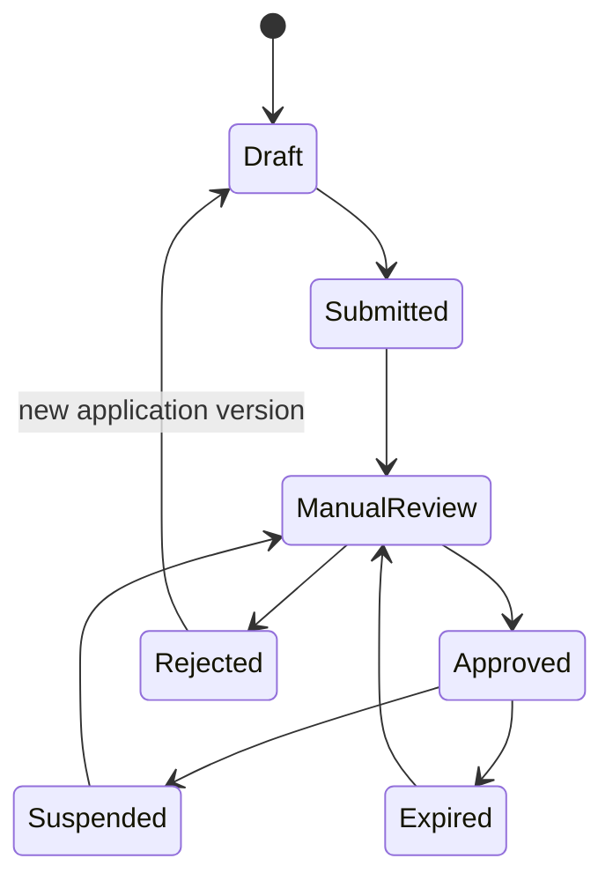
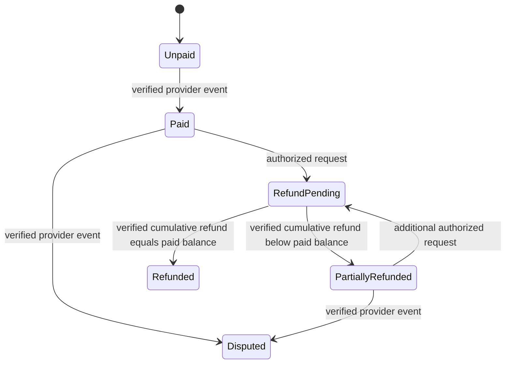

# Data Model and Invariants

**Status:** Proposed schema contract. Names in this document are the source of truth for the initial Drizzle schema.

## 1. Conventions

- PostgreSQL UUID primary keys generated server-side.
- `created_at` is immutable; mutable records also use `updated_at` and optimistic `version` where relevant.
- Money is integer minor units plus ISO currency; never floating point.
- External IDs are unique within a provider namespace.
- All organization-owned rows include `organization_id`; every DAL query scopes it explicitly.
- Regulatory/compliance evidence records include source, decision maker, effective date, optional expiry/review date, and content/version hash.
- Append-only tables are protected by application code and database triggers that reject update/delete.
- Domain/database state values use lowercase `snake_case`; user-facing labels are presentation mappings. Evidence-reference hashes, when present, are lowercase SHA-256 hex.

## 2. Identity and organization

| Table | Purpose | Critical constraints |
|---|---|---|
| `actors` | Local projection of a Clerk user | unique `clerk_user_id`; no authorization stored only in Clerk metadata |
| `organizations` | Buyer or internal operating organization | unique `clerk_organization_id` when linked; lifecycle status |
| `organization_memberships` | Actor membership and business role | unique actor/organization; status required |
| `staff_capabilities` | Internal least-privilege grants | unique actor/capability; grant/revoke evidence; not self-grantable |

## 3. Researcher approval

| Table | Purpose | Critical constraints |
|---|---|---|
| `researcher_applications` | Draft/submitted application | owned by actor/organization; status transitions through policy |
| `application_evidence` | Metadata for private evidence documents | private object key, hash, type, retention class; no public URL |
| `attestation_versions` | Immutable approved wording | content hash and effective interval |
| `attestations` | Applicant/checkout acceptance | actor, organization, version, purpose, order if checkout, timestamp, request context |
| `approval_decisions` | Immutable approval/rejection/suspension history | append-only; reason and evidence reference required |

Application states:

Only `Approved` and unexpired status can pass the buyer gate.

## 4. Catalog, lots, and evidence

| Table | Purpose | Critical constraints |
|---|---|---|
| `categories` | Approved internal/public taxonomy | no seed data without catalog approval |
| `products` | Stable product identity | draft/active/retired; no saleable default |
| `product_versions` | Immutable published product copy/spec | approval record and content hash required |
| `product_categories` | Product/category relation | active approved versions only on public surfaces |
| `price_books` | Approved currency/price intervals | server-only calculation; effective interval cannot overlap per scope |
| `lots` | Lot/batch and supported test fields | product link, status, received/released dates, actual quantity |
| `coa_documents` | Lot-level COA metadata | private object key, SHA-256, lot link, approval status |
| `inventory_ledger` | Receipts, reservations, releases, adjustments, fulfillment | append-only; actor/reason/reference required |

Product publication requires an approved product version. A purity value can appear only when it is sourced from an approved lot/COA result; a product-level “typical purity” is not supported.

## 5. Jurisdiction and eligibility

| Table | Purpose | Critical constraints |
|---|---|---|
| `jurisdictions` | State/DC/territory codes and class | data identity only; not permission |
| `jurisdiction_policy_versions` | Immutable policy release | effective interval, approver, evidence hash |
| `product_jurisdiction_rules` | SKU + destination decision | stored value `allowed`, `manual_review`, `blocked`, or `unknown`; unique per active policy version; presentation maps to the required title-cased values |
| `eligibility_evaluations` | Immutable aggregate snapshot | records every independent gate and input version |
| `compliance_cases` | Holds/manual review | open/approved/rejected/expired; reason/evidence |
| `compliance_decisions` | Append-only case decisions | actor, capability, reason, evidence, step-up time |
| `manual_review_case_decisions` | Exact-case resolution for one base manual-review rule and order line | order + order item + exact jurisdiction-rule ID + immutable eligibility-evaluation hash + expiry; append-only; approval passes only that unchanged SKU-line snapshot |

Independent gate keys:

- `buyer_verification`
- `catalog_approval`
- `product_jurisdiction`
- `payment_provider`
- `tax`
- `shipping`
- `inventory_lot`
- `compliance_clearance`
- `launch_control`

Each gate result is `PASS`, `MANUAL_REVIEW`, `BLOCKED`, or `UNKNOWN`. Aggregation order is `BLOCKED` > `UNKNOWN` > `MANUAL_REVIEW` > `PASS`; only all-`PASS` may create hosted checkout.

The pure domain representation uses lowercase equivalents. Exactly one result is required for every non-jurisdiction gate and every expected order line requires its own line-bound `product_jurisdiction` result. Missing, duplicate, unexpected, malformed, or evaluator-error results become `unknown`; an empty/malformed expected-line set cannot pass. Unknown and manual-review results create a compliance hold, while unknown also routes the responsible gap to policy review. See `domain-policies.md`.

## 6. Cart, order, payment, and fulfillment

| Table | Purpose | Critical constraints |
|---|---|---|
| `carts` | Authenticated individual or organization draft | exactly one individual owner or organization owner; no anonymous owner |
| `cart_items` | Product/quantity selection | browser price is not stored as authority |
| `orders` | Durable commercial workflow | integer totals, destination snapshot, eligibility reference, state |
| `order_items` | Product/lot/price snapshot | immutable after checkout creation |
| `checkout_attempts` | Hosted session attempts | idempotency key, provider session ID, status |
| `provider_webhook_events` | Recoverable deduplication/inbox | unique provider/event ID, payload hash, processing state/attempt/lease; failed or stale events remain retryable |
| `payment_journal` | Append-only normalized payment events | amount/currency/status/provider reference |
| `refund_requests` | Authorized refund workflow | reason, amount, capability, idempotency |
| `fulfillment_releases` | One-time release evidence | unique order; payment journal and clearance references; current state derived from append-only release events |
| `fulfillment_release_events` | Issue/revoke/expire/consume history | append-only; only an active unexpired release may be consumed once |
| `shipments` | Fulfillment result | release required; actual carrier/tracking only |

Order states:

```mermaid
stateDiagram-v2
  [*] --> Draft
  Draft --> EligibilityReview
  EligibilityReview --> ComplianceHold
  ComplianceHold --> EligibilityReview: approved or evidence changed
  EligibilityReview --> ReadyForCheckout: all gates pass
  ReadyForCheckout --> CheckoutPending
  CheckoutPending --> PaymentFailed: verified failure or authoritative session expiration
  CheckoutPending --> PaidPendingClearance: verified webhook
  PaidPendingClearance --> PaidOnHold: any gate not pass
  PaidPendingClearance --> ReadyForFulfillment: all gates pass
  PaidOnHold --> ReadyForFulfillment: fresh all-pass evaluation and current release
  ReadyForFulfillment --> PaidOnHold: clearance changed; revoke release
  ReadyForFulfillment --> FulfillmentInProgress
  FulfillmentInProgress --> PaidOnHold: clearance changed before carrier handoff; revoke release
  FulfillmentInProgress --> Fulfilled
  Draft --> Cancelled
  EligibilityReview --> Cancelled
  ComplianceHold --> Cancelled
  PaymentFailed --> Cancelled
```

No transition to a paid state originates from the browser redirect. A restrictive policy or clearance change appends a release-revocation event before shipment can proceed. Release consumption rechecks the current derived release state and eligibility in the same transaction; a previously issued but revoked/expired release cannot authorize fulfillment. A revoked or expired release may be re-issued only with fresh all-pass clearance and a new release-event version; a consumed release is terminal.

A verified provider dispute transitions any paid, unfulfilled order to `paid_on_hold`, clears its active release binding, and transactionally appends the release revocation when one exists. A browser report cannot trigger this transition, and a carrier-handed-off/fulfilled order remains terminal in this initial graph.

Refund status is a separate financial state derived from the append-only journal:

## 7. Operations and audit

| Table | Purpose | Critical constraints |
|---|---|---|
| `launch_gates` | Evidence-backed production capability switches | scope, state, approver, evidence, review date; absent is closed |
| `idempotency_records` | Application mutation dedupe | key + scope unique; request hash prevents key reuse with different data |
| `outbox_messages` | Transactional delivery queue | template/data hash, recipient reference, attempts; no secrets |
| `audit_events` | Security/business action history | append-only, actor, action, resource, correlation ID, redacted metadata |

## 8. Database-enforced invariants

1. Update/delete triggers reject changes to append-only tables.
2. Unique constraints prevent duplicate provider events, checkout attempts, fulfillment releases, and idempotency operations.
3. Check constraints enforce nonnegative quantities/amounts and known enums.
4. Foreign keys prevent orphaned lot/COA, decision/evidence, and fulfillment/payment references.
5. Partial unique indexes permit only one current product version and one active policy version per scope.
6. The application role receives no schema-owner rights and no update/delete grants on journal tables.
7. Inventory allocation locks the relevant lot rows/ledger balance and rejects negative availability.
8. Order items and totals become immutable once `checkout_pending` begins.

## 9. Retention and deletion

Retention periods are unresolved and require privacy/legal approval. Until approved, the application must support retention classes and legal holds without automatically deleting compliance/payment evidence. Account deletion must de-identify non-required profile fields while preserving records required for fraud, payment, audit, and legal obligations. Raw applicant evidence should have the shortest approved retention and remain private.
