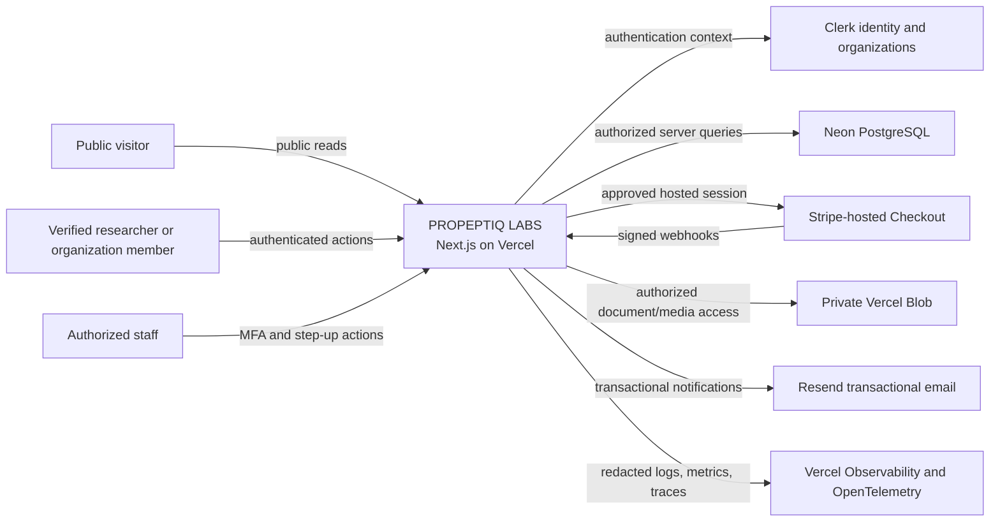
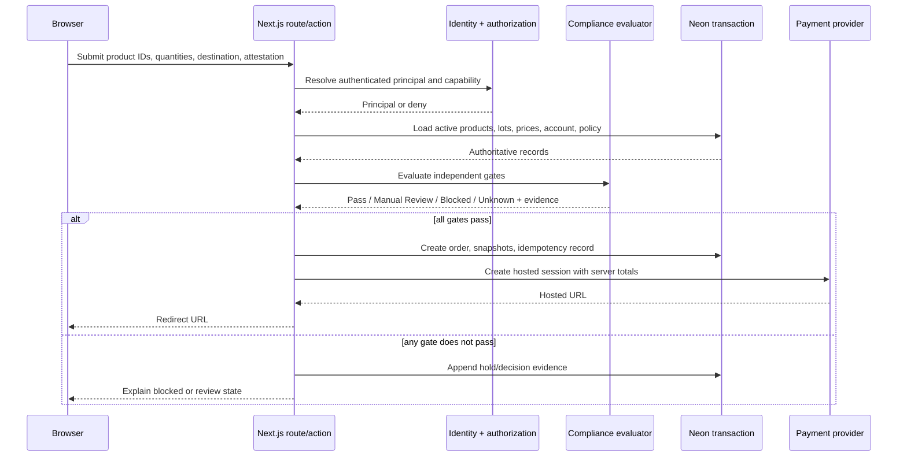
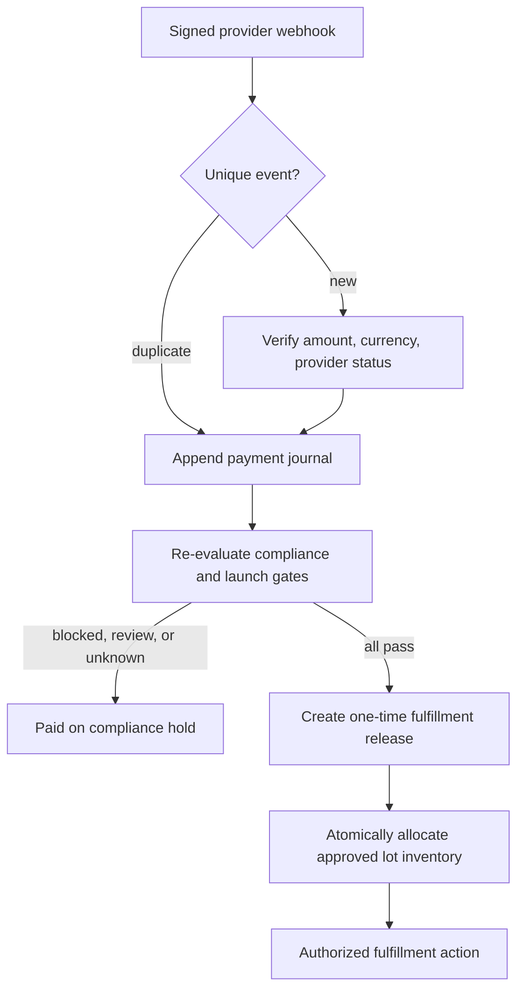

# System Architecture

**Status:** Proposed implementation architecture derived from the binding product requirements.

## 1. System context

The browser is never a trust boundary for price, identity, role, eligibility, order state, payment status, inventory, or fulfillment release.

## 2. Deployment shape

- Next.js App Router runs on Vercel Functions/Node runtime.
- Public pages are server-rendered/static where safe. Identity-, catalog-, eligibility-, and order-dependent pages are dynamic and uncached across principals.
- Clerk establishes identity and organization context. The application database remains the source of truth for business approval, staff capability, compliance, and resource ownership.
- The Neon serverless driver uses HTTP for one-shot reads and transactions through an appropriate transaction-capable path where multiple statements must commit atomically.
- Drizzle owns schema types and versioned SQL migrations.
- Private Blob objects are delivered through authenticated server routes; raw private tokens/URLs never reach unauthorized clients.
- Stripe collects card data on its hosted page. No application page accepts card fields.
- Resend receives only the minimum recipient and template data required for transactional messages.
- Vercel Firewall handles coarse edge rate limits; application-level idempotency and actor/resource limits protect sensitive mutations.

## 3. Code boundaries

| Boundary | Planned location | Responsibility |
|---|---|---|
| Domain | `src/domain/` | Pure enums, policies, state transitions, invariants; no provider imports |
| Identity adapter | `src/lib/server/auth/` | Convert Clerk session to a minimal principal |
| Authorization | `src/lib/server/authorization/` | Capability checks and resource-scoped policy |
| Data access | `src/lib/server/dal/` | Server-only queries, tenant scoping, transactions |
| Database | `src/db/` | Drizzle schema, connection, migrations |
| Compliance | `src/lib/server/compliance/` | Gate evaluation, holds, decisions, attestations |
| Payments | `src/lib/server/payments/` | Provider interface, Stripe adapter, webhook processing, journal |
| Storage | `src/lib/server/storage/` | Private Blob adapter, object metadata/authorization |
| Email | `src/lib/server/email/` | Provider interface, transactional templates/outbox |
| Observability | `src/lib/server/observability/` | Structured logs, correlation IDs, redaction, traces |
| UI | `src/app/`, `src/components/` | Server-first routes and accessible shadcn components |

`server-only` imports protect all provider, secret, authorization, and DAL modules. UI code consumes typed view models rather than raw database records.

## 4. Request flow

## 5. Fulfillment release

The redirect/success page never enters this flow.

## 6. Consistency and concurrency

- Order creation, price snapshots, eligibility snapshot references, and initial inventory reservation occur in one transaction.
- Unique idempotency constraints protect application mutations and provider session creation.
- Webhook event insertion uses a unique `(provider, provider_event_id)` constraint.
- Fulfillment release has a unique `order_id` and a consumed timestamp; consuming and inventory allocation occur atomically.
- Inventory is an append-only ledger. Available quantity is derived/materialized under transaction and may never go negative.
- Review decisions, attestations, payment journal, inventory ledger, and audit events are append-only.

## 7. Caching rules

- Public policy pages may cache by deployment.
- Public catalog results may cache only by an explicit catalog version and contain approved public fields.
- Account, eligibility, holds, order, payment, COA access, and admin pages are private/no-store.
- A CDN cache key is never used as an authorization mechanism.
- Product or jurisdiction policy changes increment a version and invalidate dependent public catalog data; checkout always reloads authoritative data.

## 8. Failure behavior

- Identity/provider/database unavailable: fail closed for protected actions.
- Missing configuration: expose a neutral unavailable state, not a permissive fallback.
- Eligibility evaluator error: return `Unknown`/hold and record an operational event.
- Email failure: retain an outbox item; do not roll back an already durable compliance/payment decision.
- Storage failure: do not publish the lot or product evidence link.
- Payment webhook failure: return a retryable error before marking the event processed.
- Observability failure: application continues only if the core decision/journal is durably stored; logs are not the audit source of truth.

## 9. Architecture launch gates

- Production resources and vendor accounts are not created by this document.
- Payment remains disabled until provider approval and all business/catalog gates exist in the database.
- No product can publish without actual approved records.
- No default jurisdiction row is interpreted as allowed.
- Production access requires separately scoped credentials and verified administrative MFA.
