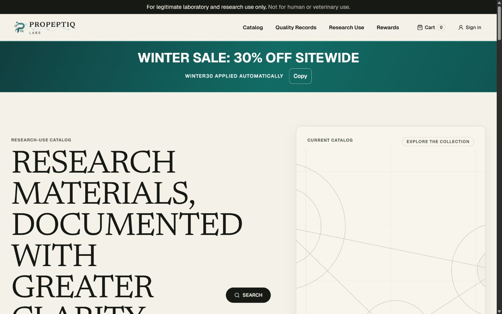
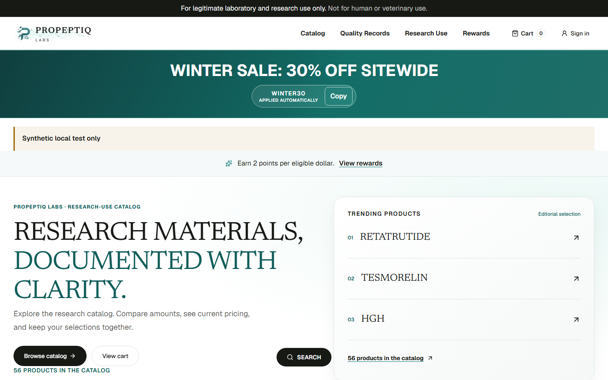
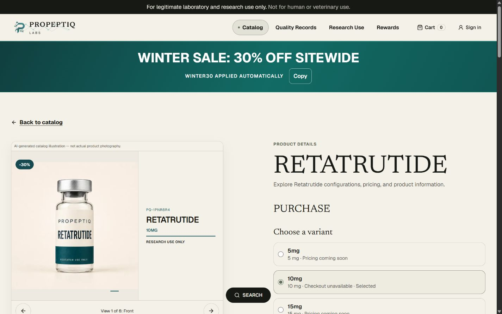
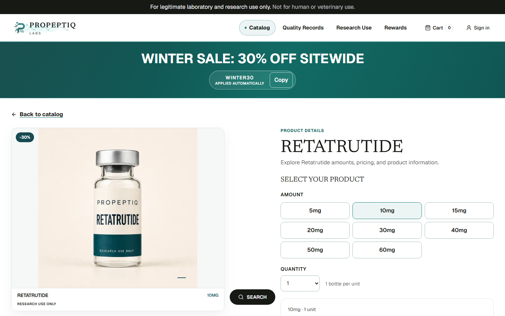
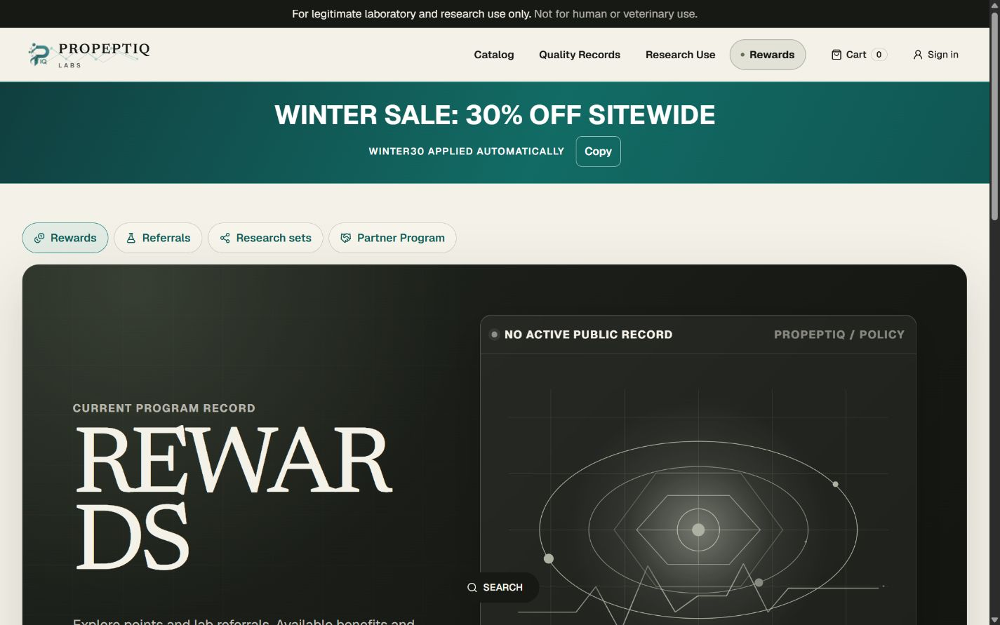
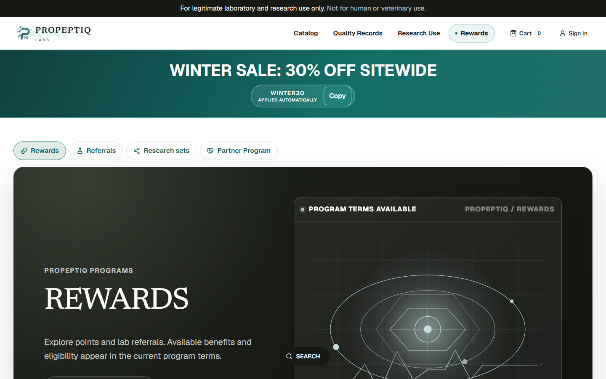
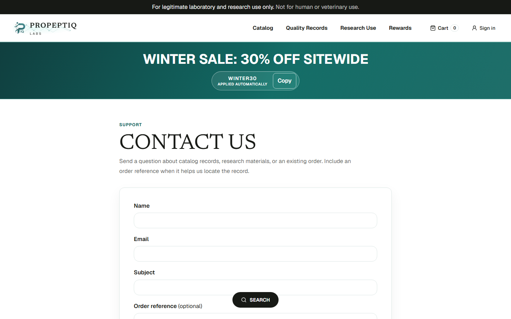

# Storefront screenshot comparisons

Before: production before this release. After: isolated local test renders, with
synthetic programs explicitly labeled. These screenshots do not establish live
ordering or email delivery. Original bottle assets are preserved; the public AI
disclosure was removed at the owner's request. Desktop viewport: 1440 × 900.

| Page | Before | After |
|---|---|---|
| Homepage |  |  |
| Retatrutide |  |  |
| Rewards |  |  |
| Contact | No previous implementation |  |

[Mobile product page](evidence/storefront-redesign/after-product-mobile.png).

The selected images above are committed so pull-request reviewers can open them.
To reproduce full-page screenshots at 375, 768, 1280, 1366, 1440 and 1920px, run:

```sh
npm run test:e2e -- tests/e2e/storefront-redesign.spec.ts
```

The suite writes each page's full-size PNG into its directory under `test-results`.
The original local investigation also preserves full-page captures under the ignored
`.codex-evidence/redesign` directory; those additional files are local evidence only.
